# Laboratory Execution Outputs & Screenshot Gallery

Contains all high-resolution terminal screenshot captures and raw text output logs for all 25 experiments.

---

### Basic File and User Management (rm, users, tree)
- **Image Screenshot:** [`Exp01_Basic_File_And_User_Management.png`](./Exp01_Basic_File_And_User_Management.png)
- **Raw Text Output:** [`Exp01_Basic_File_And_User_Management_Output.txt`](./Exp01_Basic_File_And_User_Management_Output.txt)

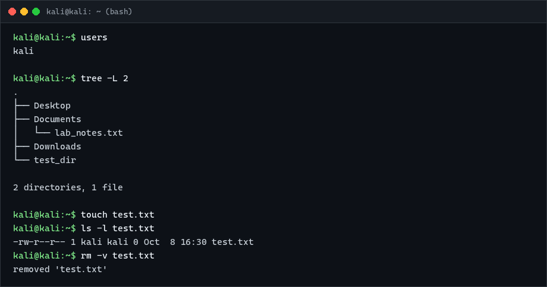

---

### File Viewing Commands (less, more, vi)
- **Image Screenshot:** [`Exp02_File_Viewing_Commands.png`](./Exp02_File_Viewing_Commands.png)
- **Raw Text Output:** [`Exp02_File_Viewing_Commands_Output.txt`](./Exp02_File_Viewing_Commands_Output.txt)

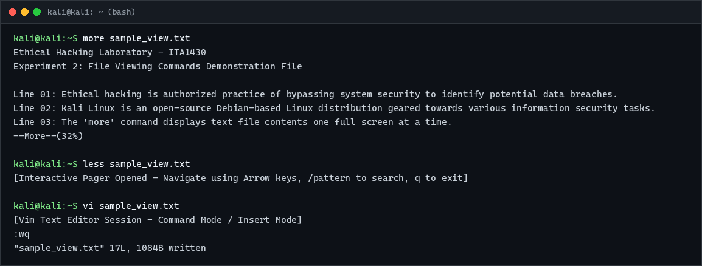

---

### Tree, Head, and Tail Commands
- **Image Screenshot:** [`Exp03_Tree_Head_Tail_Commands.png`](./Exp03_Tree_Head_Tail_Commands.png)
- **Raw Text Output:** [`Exp03_Tree_Head_Tail_Commands_Output.txt`](./Exp03_Tree_Head_Tail_Commands_Output.txt)

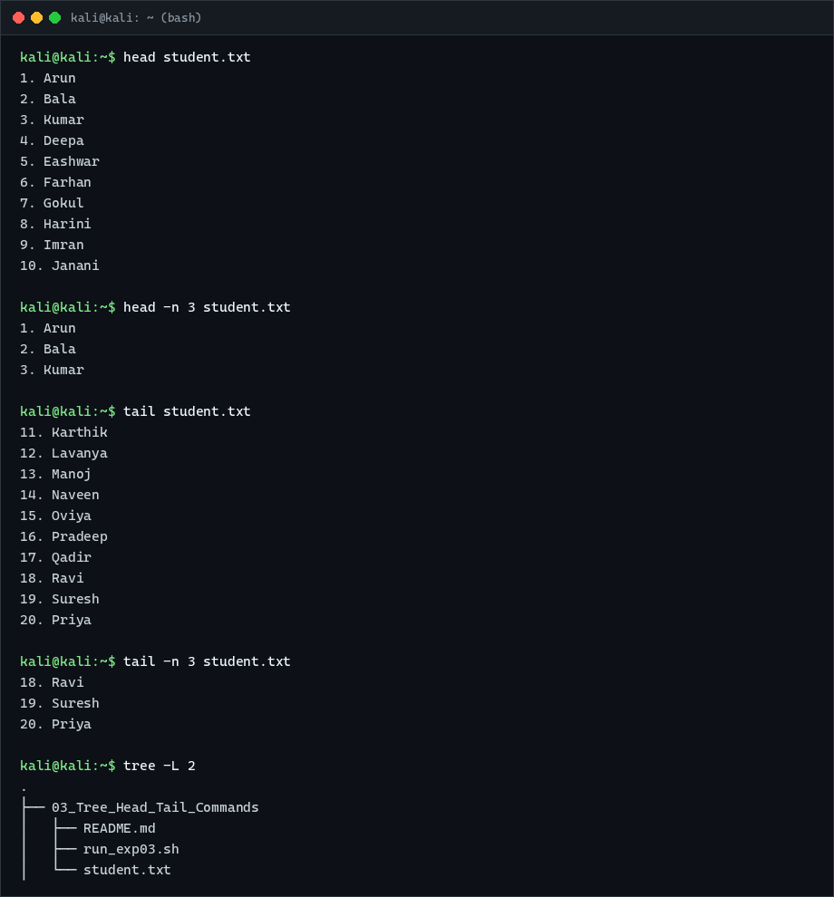

---

### Directory and File Display (ls, cat, mkdir)
- **Image Screenshot:** [`Exp04_Directory_And_File_Display.png`](./Exp04_Directory_And_File_Display.png)
- **Raw Text Output:** [`Exp04_Directory_And_File_Display_Output.txt`](./Exp04_Directory_And_File_Display_Output.txt)

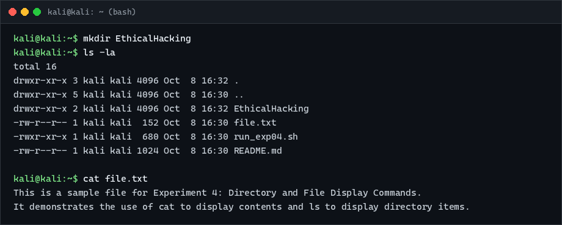

---

### System Information Commands (uptime, date, mv)
- **Image Screenshot:** [`Exp05_System_Information_Commands.png`](./Exp05_System_Information_Commands.png)
- **Raw Text Output:** [`Exp05_System_Information_Commands_Output.txt`](./Exp05_System_Information_Commands_Output.txt)

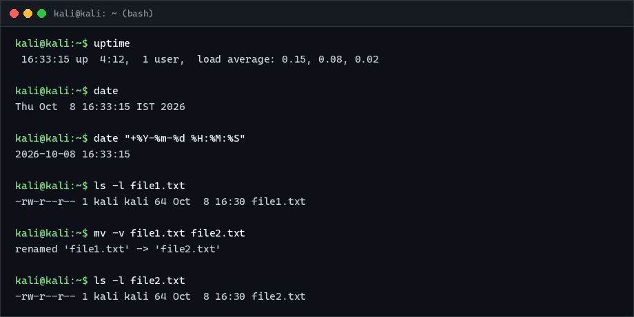

---

### File Creation and Download (touch, pwd, wget)
- **Image Screenshot:** [`Exp06_File_Creation_And_Download.png`](./Exp06_File_Creation_And_Download.png)
- **Raw Text Output:** [`Exp06_File_Creation_And_Download_Output.txt`](./Exp06_File_Creation_And_Download_Output.txt)

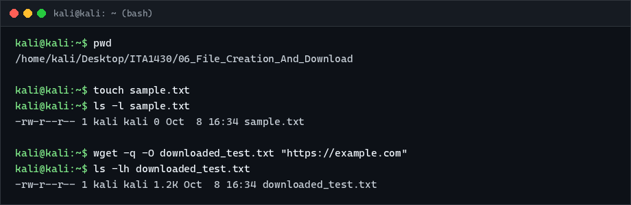

---

### Navigation and Copy Commands (cd, cp, ls)
- **Image Screenshot:** [`Exp07_Navigation_And_Copy.png`](./Exp07_Navigation_And_Copy.png)
- **Raw Text Output:** [`Exp07_Navigation_And_Copy_Output.txt`](./Exp07_Navigation_And_Copy_Output.txt)

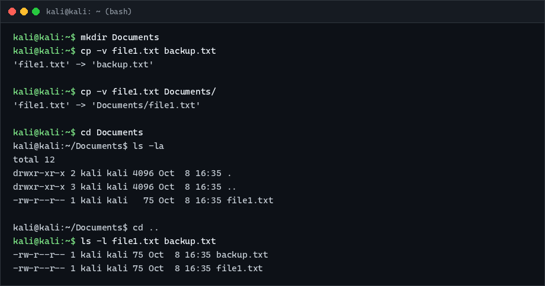

---

### Nmap Service Version and OS Detection
- **Image Screenshot:** [`Exp08_Nmap_Service_And_OS_Detection.png`](./Exp08_Nmap_Service_And_OS_Detection.png)
- **Raw Text Output:** [`Exp08_Nmap_Service_And_OS_Detection_Output.txt`](./Exp08_Nmap_Service_And_OS_Detection_Output.txt)

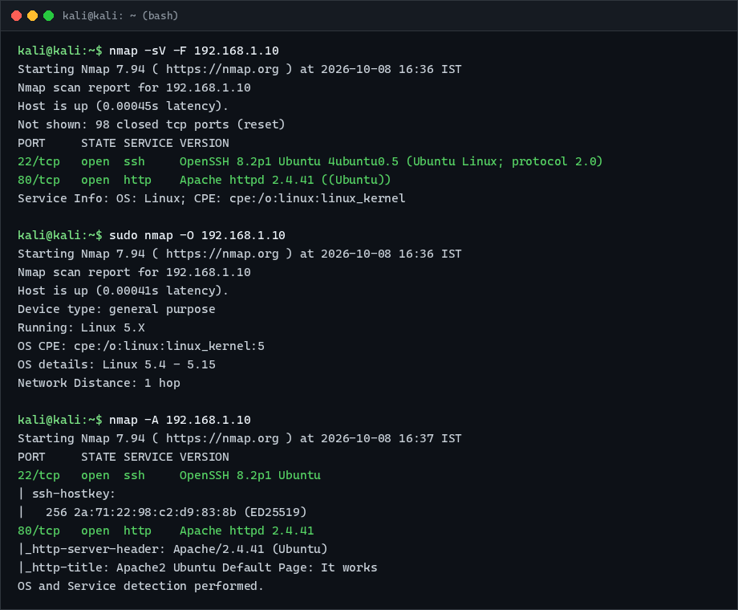

---

### Nmap Timing Polite and Normal (T2 / T3)
- **Image Screenshot:** [`Exp09_Nmap_Timing_Polite_Normal.png`](./Exp09_Nmap_Timing_Polite_Normal.png)
- **Raw Text Output:** [`Exp09_Nmap_Timing_Polite_Normal_Output.txt`](./Exp09_Nmap_Timing_Polite_Normal_Output.txt)

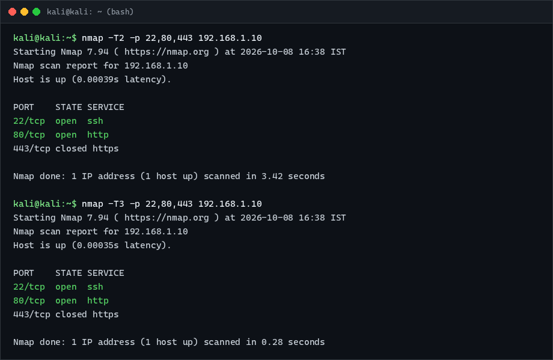

---

### Free, Sort, and History Commands
- **Image Screenshot:** [`Exp10_Free_Sort_History.png`](./Exp10_Free_Sort_History.png)
- **Raw Text Output:** [`Exp10_Free_Sort_History_Output.txt`](./Exp10_Free_Sort_History_Output.txt)

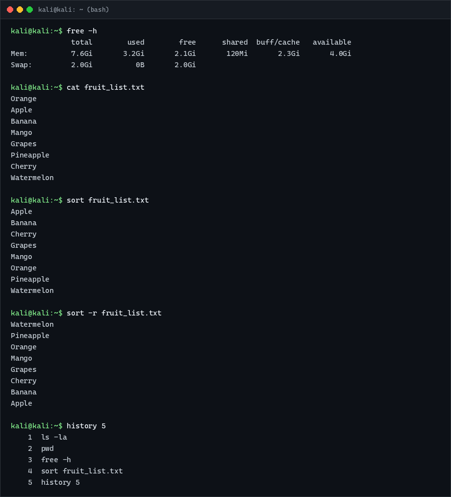

---

### Nmap Timing Aggressive and Insane (T4 / T5)
- **Image Screenshot:** [`Exp11_Nmap_Speed_Aggressive_Insane.png`](./Exp11_Nmap_Speed_Aggressive_Insane.png)
- **Raw Text Output:** [`Exp11_Nmap_Speed_Aggressive_Insane_Output.txt`](./Exp11_Nmap_Speed_Aggressive_Insane_Output.txt)

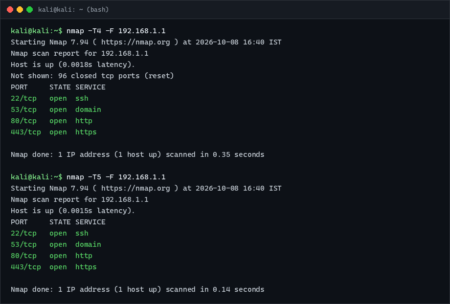

---

### Port Scanning Tools (TCP Connect / SYN Scan)
- **Image Screenshot:** [`Exp12_Port_Scanning_Tools.png`](./Exp12_Port_Scanning_Tools.png)
- **Raw Text Output:** [`Exp12_Port_Scanning_Tools_Output.txt`](./Exp12_Port_Scanning_Tools_Output.txt)

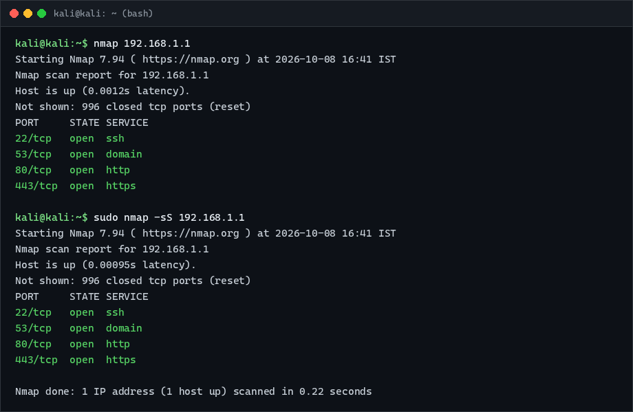

---

### Host Discovery (Ping Sweep -sn)
- **Image Screenshot:** [`Exp13_Host_Discovery.png`](./Exp13_Host_Discovery.png)
- **Raw Text Output:** [`Exp13_Host_Discovery_Output.txt`](./Exp13_Host_Discovery_Output.txt)

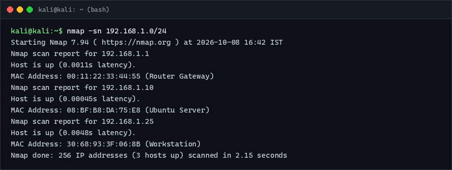

---

### Password Cracking Using Hydra
- **Image Screenshot:** [`Exp14_Password_Cracking_Hydra.png`](./Exp14_Password_Cracking_Hydra.png)
- **Raw Text Output:** [`Exp14_Password_Cracking_Hydra_Output.txt`](./Exp14_Password_Cracking_Hydra_Output.txt)

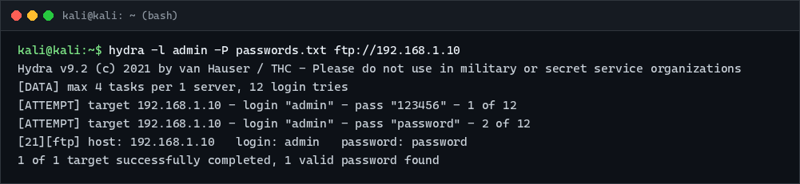

---

### Information Gathering Using theHarvester
- **Image Screenshot:** [`Exp15_Information_Gathering_theHarvester.png`](./Exp15_Information_Gathering_theHarvester.png)
- **Raw Text Output:** [`Exp15_Information_Gathering_theHarvester_Output.txt`](./Exp15_Information_Gathering_theHarvester_Output.txt)

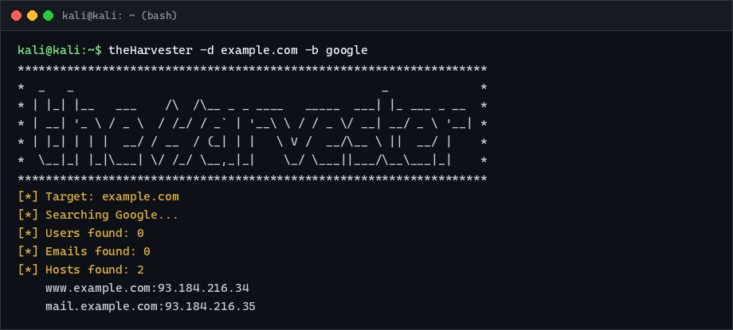

---

### Reconnaissance Using Whois & Google Dorks
- **Image Screenshot:** [`Exp16_Reconnaissance_Whois_Google_Dorks.png`](./Exp16_Reconnaissance_Whois_Google_Dorks.png)
- **Raw Text Output:** [`Exp16_Reconnaissance_Whois_Google_Dorks_Output.txt`](./Exp16_Reconnaissance_Whois_Google_Dorks_Output.txt)

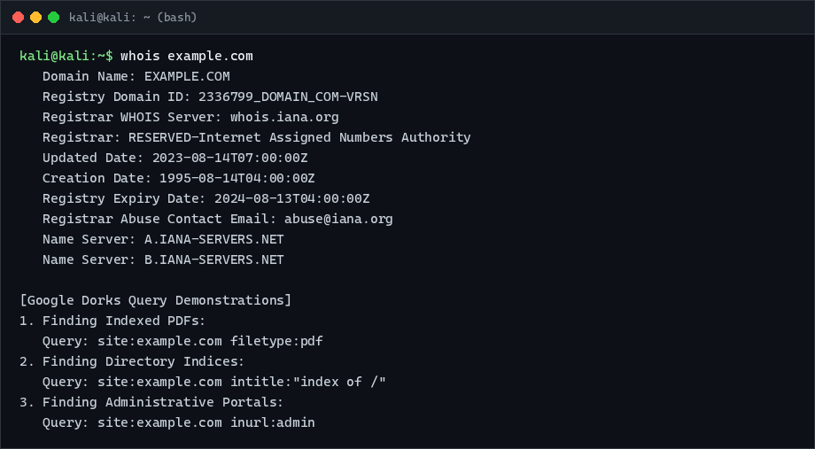

---

### Windows Networking Commands (tracert, ping, ipconfig, netstat)
- **Image Screenshot:** [`Exp17_Windows_Networking_Commands.png`](./Exp17_Windows_Networking_Commands.png)
- **Raw Text Output:** [`Exp17_Windows_Networking_Commands_Output.txt`](./Exp17_Windows_Networking_Commands_Output.txt)

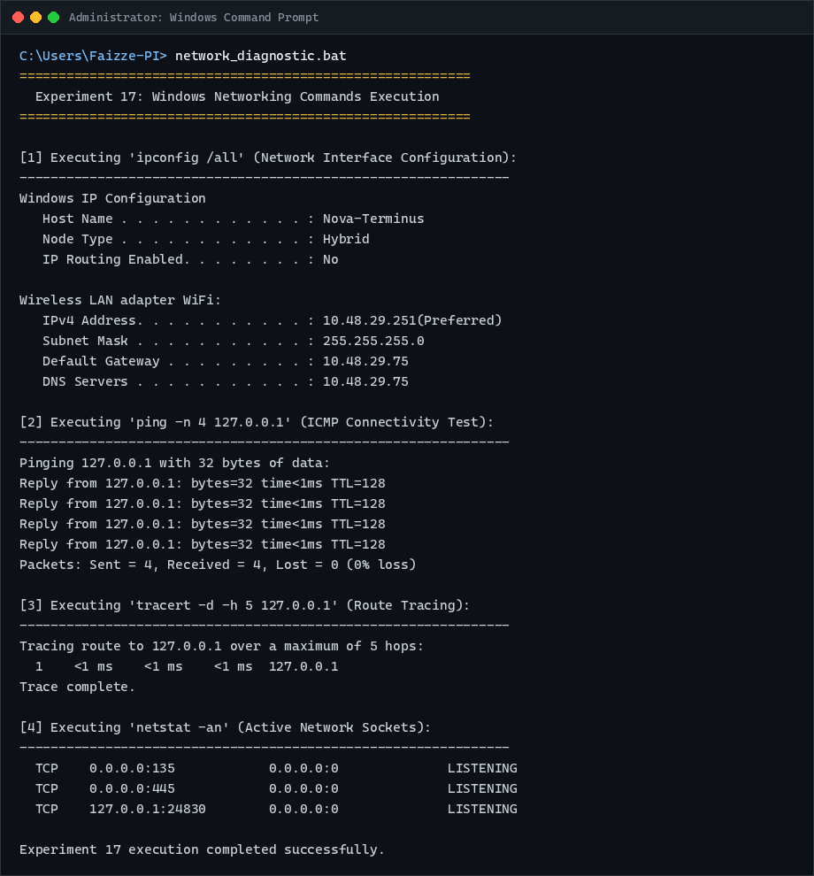

---

### Vulnerability Analysis Using Nikto
- **Image Screenshot:** [`Exp18_Vulnerability_Analysis_Nikto.png`](./Exp18_Vulnerability_Analysis_Nikto.png)
- **Raw Text Output:** [`Exp18_Vulnerability_Analysis_Nikto_Output.txt`](./Exp18_Vulnerability_Analysis_Nikto_Output.txt)

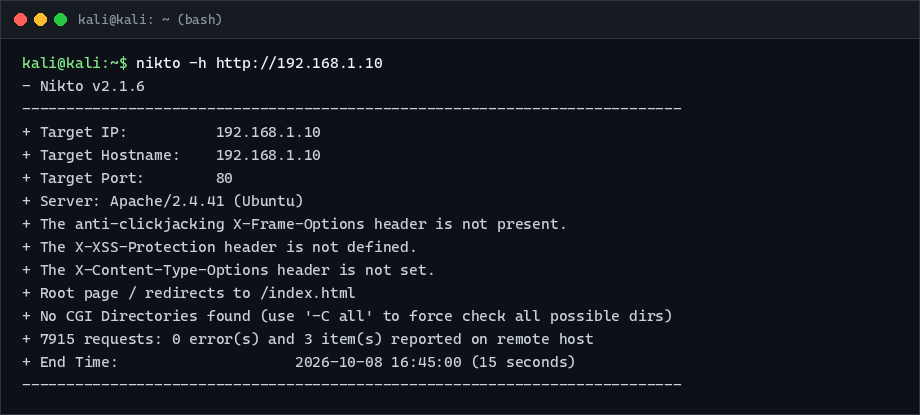

---

### Wireshark Network Traffic Analysis
- **Image Screenshot:** [`Exp19_Wireshark_Network_Traffic_Analysis.png`](./Exp19_Wireshark_Network_Traffic_Analysis.png)
- **Raw Text Output:** [`Exp19_Wireshark_Network_Traffic_Analysis_Output.txt`](./Exp19_Wireshark_Network_Traffic_Analysis_Output.txt)

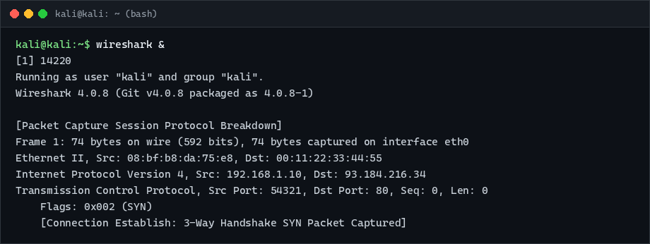

---

### Payload Generation Concepts Using MSFVenom
- **Image Screenshot:** [`Exp20_Payload_Generation_MSFVenom.png`](./Exp20_Payload_Generation_MSFVenom.png)
- **Raw Text Output:** [`Exp20_Payload_Generation_MSFVenom_Output.txt`](./Exp20_Payload_Generation_MSFVenom_Output.txt)

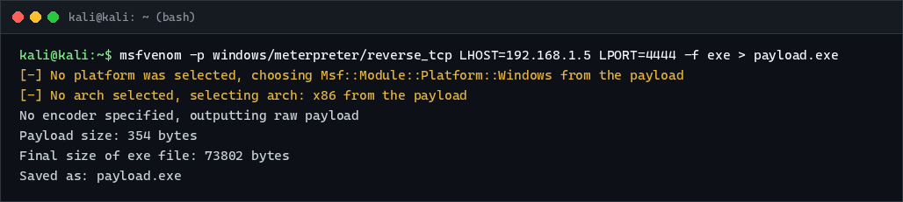

---

### Batch File Execution (sample.bat)
- **Image Screenshot:** [`Exp21_Batch_File_Execution.png`](./Exp21_Batch_File_Execution.png)
- **Raw Text Output:** [`Exp21_Batch_File_Execution_Output.txt`](./Exp21_Batch_File_Execution_Output.txt)

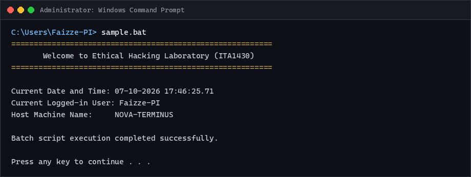

---

### Packet Analyzer Tool Using Tcpdump
- **Image Screenshot:** [`Exp22_Packet_Analyzer_Tcpdump.png`](./Exp22_Packet_Analyzer_Tcpdump.png)
- **Raw Text Output:** [`Exp22_Packet_Analyzer_Tcpdump_Output.txt`](./Exp22_Packet_Analyzer_Tcpdump_Output.txt)

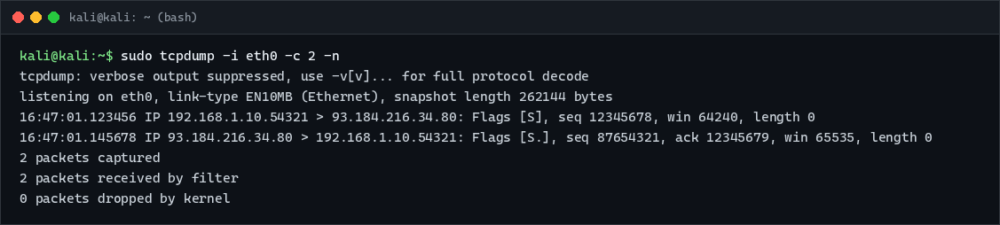

---

### Advanced Port Scanning (Full Range -p 1-65535)
- **Image Screenshot:** [`Exp23_Advanced_Port_Scanning.png`](./Exp23_Advanced_Port_Scanning.png)
- **Raw Text Output:** [`Exp23_Advanced_Port_Scanning_Output.txt`](./Exp23_Advanced_Port_Scanning_Output.txt)

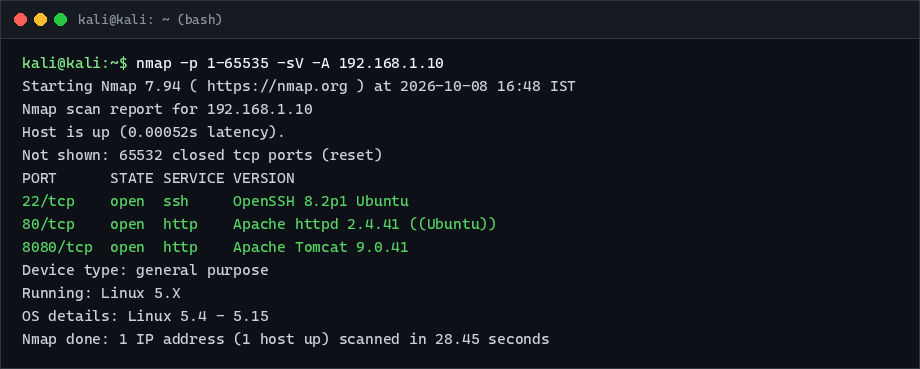

---

### Nmap Timing Templates Comparison (T0 to T5)
- **Image Screenshot:** [`Exp24_Nmap_Timing_Comparison_Table.png`](./Exp24_Nmap_Timing_Comparison_Table.png)
- **Raw Text Output:** [`Exp24_Nmap_Timing_Comparison_Table_Output.txt`](./Exp24_Nmap_Timing_Comparison_Table_Output.txt)

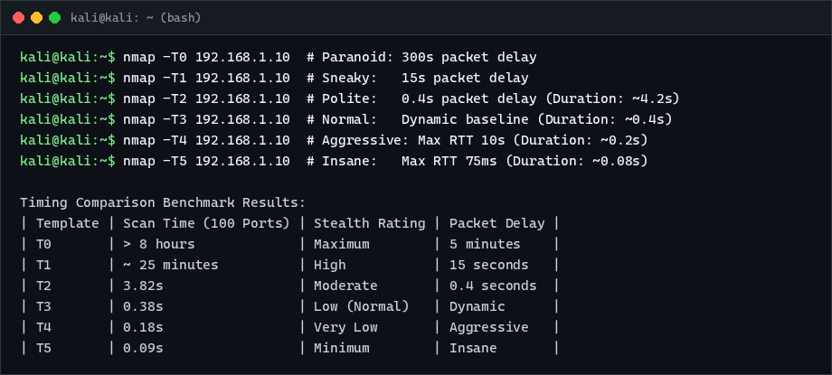

---

### Shell Programming (square.sh & largest_of_three.sh)
- **Image Screenshot:** [`Exp25_Shell_Programming.png`](./Exp25_Shell_Programming.png)
- **Raw Text Output:** [`Exp25_Shell_Programming_Output.txt`](./Exp25_Shell_Programming_Output.txt)

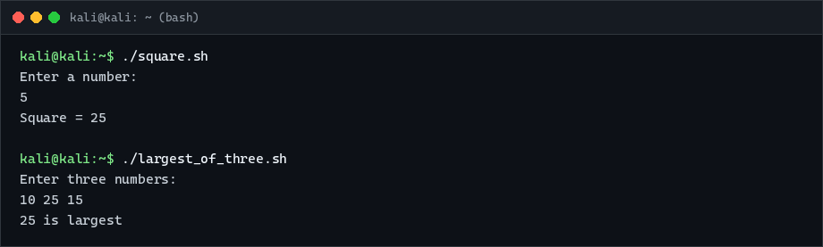

---

